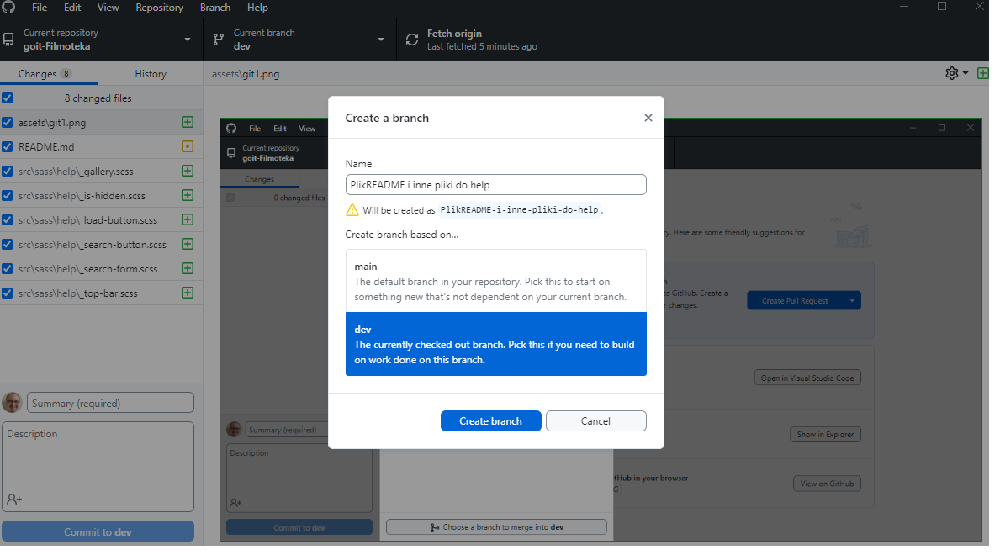
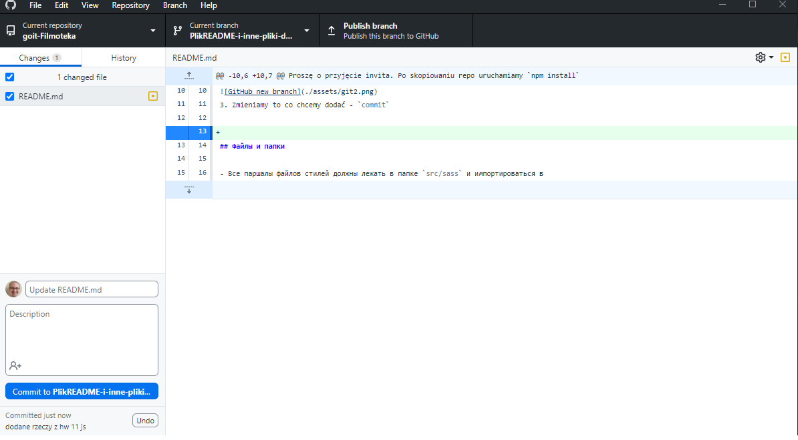
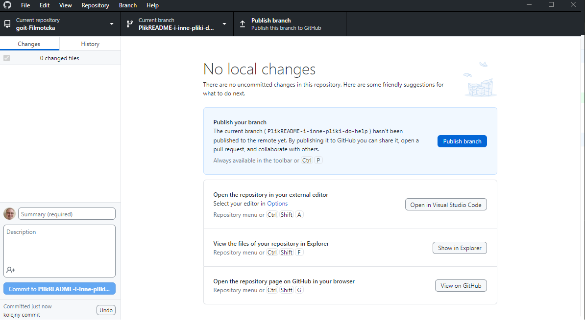
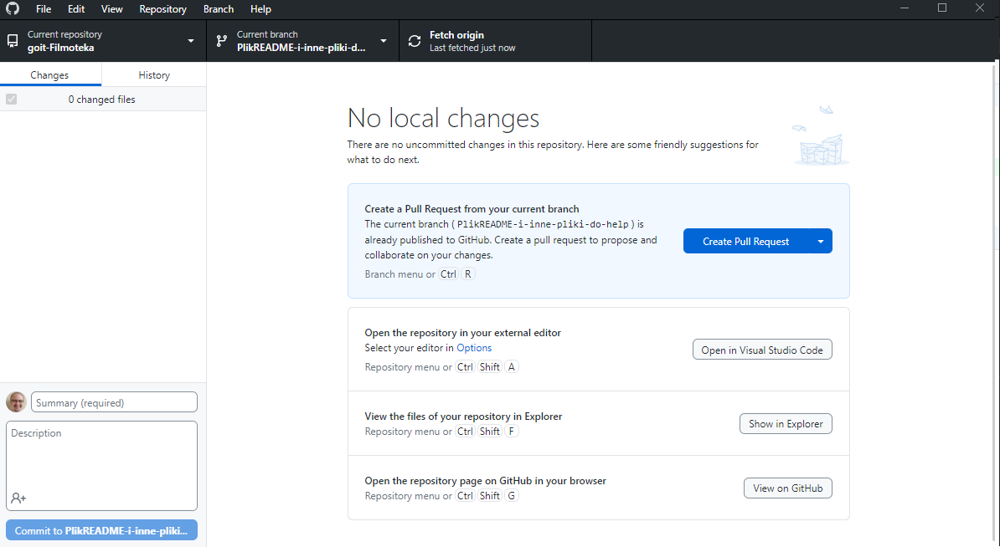
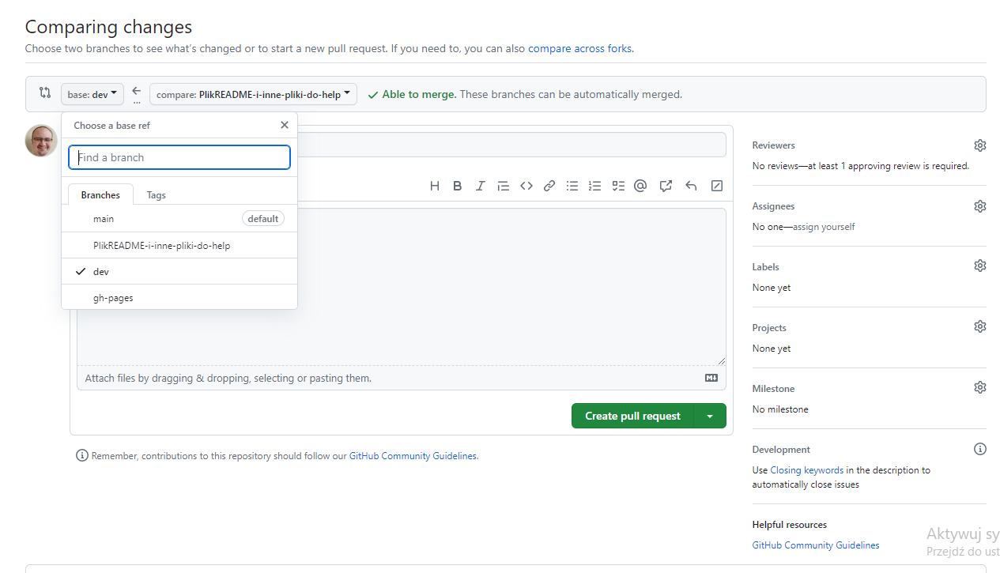

# Filmoteka

Proszę o przyjęcie invita. Po skopiowaniu repo uruchamiamy `npm install`

## Praca z repo

1. Gałąź `main` - pushuje tam tylko Team Leader
2. Nowa funkcja - zakładamy własny branch z nazwą funkcji.

3. Zmieniamy to co chcemy dodać - `commit`

4. Publikujemy branch - `publish`

5. Tworzymy pull requesta - `PR`

6. Wybieramy na stronie branch dev i dodajemy kogos do review

7. OSOBA ROBIĄCA REVIEW - nie tylko ja - otwiera ten branch w swoim VSC i sprawdza przez `npm start` wchodząc na lokalny serwer czy to co druga osoba zrobiła działa.
8. Jeśli działa to WTEDY do piero zatwierdza pull requesta.
9. Konflicty z automatu odrzucamy i naprawiamy localnie (przed zrobieniem pull requesta robimy fetch)
10. Warunek zaakceptowania pull requesta - nie ma kolizji oraz nie wysypuje builda (nie zawsza scryptu)

## Help
Wgrałem z mojego HW 11 pliki SASS i i JS - nie są podłączone jeszcze do strony więc trzeba zdecydować jak to dzialimy i kto chce co zrobić.
1. `JsLocalStorage` - usprawnia operacje na local storage
2. `APIurl` - malutka funkcja aktualizaująca zapytanie do API - wymaga dostosowania do API TMDB
3. `counterMatch` - funkcja służąca do nabijania licznika przy paginacji - obsługuje tylko dodawanie, można dorobić też odejmowanie
4. `fetchphotos` - funkcja obsługująca fetch za pomocą axiosa
5. `galleryMaker` - mięsko aplikacji - chyba się nie przyda
6. `renderGallery` - wymaga dostosowania (destrukturyzacja otrzymywanych danych) - oraz poprawnego markup html dla filmu

## Droga numer 1
Podział całościowy - dana osoba przygotowuje wszystko - od fetcha (data tier `fetch` => biznes logic `logic tier` => presentation tier `render`) po wyrenderowanie elementu.
Mamy do przygotowania następujące rzeczy:
1. Pierwsza załadowana strona
2. Wyszukiwanie po nazwie
3. Moduł My Library - powienien być odrębny - połączenie tego na jednym html byłoby możliwe ale dla jednej osoby wykonującej cały projekt
4. Paginacja - zawsze 20 elementów na stronie.
5. Okno modalne (szczegóły pojedynczego filmu)
6. Dopracowanie CSS

Wady to będziemy się dublować (np ileś osób będzie pisało prawie tego samego fetch)
Zalety - mamy mało punktów styku

## Droga numer 2
Podział funkcyjny:
1. jedna osoba przygotowuje funkcje `fetch` (data)
2. inni ludzie przygotowuja logic
3. inni presentation + CSS
Zalety - nie dublujemy swojej pracy - wymaga gruntownych testów - jakie dane otrzymujemy i chcemy wykorzystać na podstawie dokumentacji API TMDB

