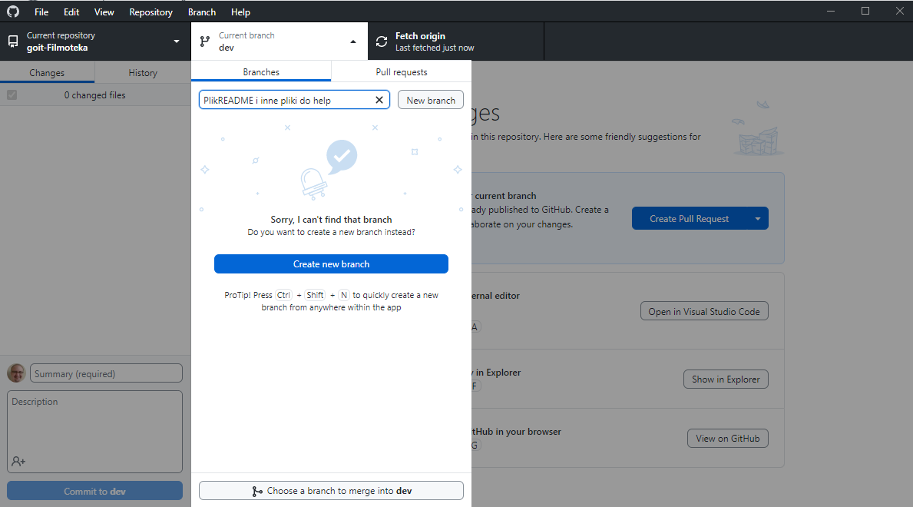

# Filmoteka

Proszę o przyjęcie invita. Po skopiowaniu repo uruchamiamy `npm install`

## Praca z repo

1. Gałąź `main` - pushuje tam tylko Team Leader
2. Nowa funkcja - zakładamy własny branch z nazwą funkcji.


3. Zmieniamy to co chcemy dodać - `commit`

## Файлы и папки

- Все паршалы файлов стилей должны лежать в папке `src/sass` и импортироваться в
  файлы стилей страниц. Например, для `index.html` файл стилей называется
  `index.scss`.
- Изображения добавляй в папку `src/images`. Сборщик оптимизирует их, но только
  при деплое продакшн версии проекта. Все это происходит в облаке, чтобы не
  нагружать твой компьютер, так как на слабых машинах это может занять много
  времени.

## Деплой

Для настройки деплоя проекта необходимо выполнить несколько дополнительных шагов
по настройке твоего репозитория. Зайди во вкладку `Settings` и в подсекции
`Actions` выбери выбери пункт `General`.


Пролистай страницу до последней секции, в которой убедись что выбраны опции как
на следующем изображении и нажми `Save`. Без этих настроек у сборки будет
недостаточно прав для автоматизации процесса деплоя.


Продакшн версия проекта будет автоматически собираться и деплоиться на GitHub
Pages, в ветку `gh-pages`, каждый раз когда обновляется ветка `main`. Например,
после прямого пуша или принятого пул-реквеста. Для этого необходимо в файле
`package.json` отредактировать поле `homepage` и скрипт `build`, заменив
`your_username` и `your_repo_name` на свои, и отправить изменения на GitHub.

```json
"homepage": "https://your_username.github.io/your_repo_name/",
"scripts": {
  "build": "parcel build src/*.html --public-url /your_repo_name/"
},
```

Далее необходимо зайти в настройки GitHub-репозитория (`Settings` > `Pages`) и
выставить раздачу продакшн версии файлов из папки `/root` ветки `gh-pages`, если
это небыло сделано автоматически.


### Статус деплоя

Статус деплоя крайнего коммита отображается иконкой возле его идентификатора.

- **Желтый цвет** - выполняется сборка и деплой проекта.
- **Зеленый цвет** - деплой завершился успешно.
- **Красный цвет** - во время линтинга, сборки или деплоя произошла ошибка.

Более детальную информацию о статусе можно посмотреть кликнув по иконке, и в
выпадающем окне перейти по ссылке `Details`.


### Живая страница

Через какое-то время, обычно пару минут, живую страницу можно будет посмотреть
по адресу указанному в отредактированном свойстве `homepage`. Например, вот
ссылка на живую версию для этого репозитория
[https://goitacademy.github.io/parcel-project-template](https://goitacademy.github.io/parcel-project-template).

Если открывается пустая страница, убедись что во вкладке `Console` нет ошибок
связанных с неправильными путями к CSS и JS файлам проекта (**404**). Скорее
всего у тебя неправильное значение свойства `homepage` или скрипта `build` в
файле `package.json`.

## Как это работает


1. После каждого пуша в ветку `main` GitHub-репозитория, запускается специальный
   скрипт (GitHub Action) из файла `.github/workflows/deploy.yml`.
2. Все файлы репозитория копируются на сервер, где проект инициализируется и
   проходит сборку перед деплоем.
3. Если все шаги прошли успешно, собранная продакшн версия файлов проекта
   отправляется в ветку `gh-pages`. В противном случае, в логе выполнения
   скрипта будет указано в чем проблема.
